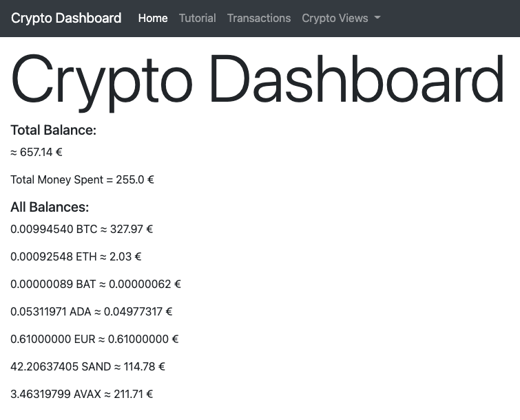

# Crypto-Dashboard

## Roadmap

### Stage 1

- Main Dashboard with Data about all current assets and overall perfomance
- Detailed view of each asset
- Databases for imported transaction data
- First iteration of the custom FiFo algorithm to get profit value for each sell order
- Basic settings
- Deployment of web app on local server (Raspberry Pi ?)

Everything visually pleasing and easy to navigate

### Stage 2

- Price alerts
- Gathering real time market date

### Stage 3

- Candlestick charts
- Basic market analysis

### Stage 4

- Possibly a trading bot ???

  

## Current State of Development
#### <i>As of 25. Jan 2022</i>

Currently I am working on Stage 1 of the project. 

\
The web app already displays some information about my assets on the main page.\
I still need to add the overall profits/losses, a donut chart for the distribrution of assets...

 

\
The Transactions page is almost done. The next step would be to use Bootstraps data table component.\
The table should be sortable, filterable and maybe even searchable.

 

\
Just like with all pages, it needs to become more visually appealing.
Maybe I will add references to the relevant transactions in the transaction database from here.
